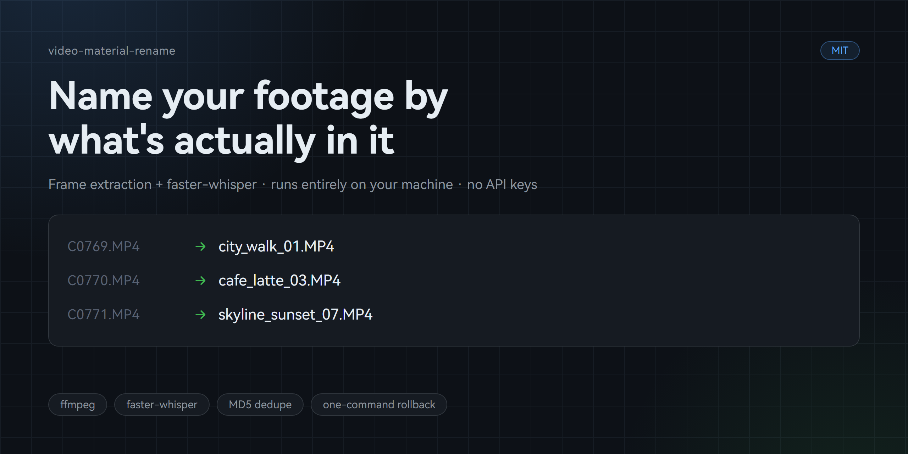

# video-material-content-rename

> 给一堆 `C0769.MP4` 这样的机器编号素材，按**画面 + 语音**内容批量重命名，并生成可检索的素材索引。

An AI-in-the-loop toolkit that renames camera-roll files by what's actually *in* them — visually and audibly.

[](LICENSE)
[](https://www.python.org/)

[English](README.md) | 中文



---

## 这解决什么问题

旅拍回传、相机导出、手机批量拍摄的素材，文件名往往是这样：

```
C0769.MP4  C0770.MP4  C0778.MP4  DJI_0001.MP4  MVI_1234.MP4 ...
```

286 个文件躺在那里，没人知道哪条是博主对着镜头说话、哪条是特写空镜、哪条有旁白、哪条只是街景过场。
剪片时只能一个个点开看，两小时就没了。

这个工具把整批素材变成：

```
街拍空镜_01.MP4   咖啡拉花_03.MP4   天际线日落_07.MP4 ...
```

外加一张索引表，告诉你每条素材里是什么。**全程本地运行，零 API 费用。**

## 和其他工具的区别

市面上的批量重命名工具，命名依据基本只有三类：

| 类型 | 代表做法 | 读了画面吗 |
|---|---|---|
| 规则驱动 | 查找替换、加序号、加日期 | 否 |
| 元数据驱动 | EXIF 时间、GPS、文件类型 | 否 |
| 文本驱动 | PDF 正文里的案号、发票字段 | 否（是文本不是图像） |

**没有一个真的去看视频画面。** 这个工具的命名依据是**画面内容 + 语音内容**双信号。

## 它是怎么工作的

```
probe.py        侦察 + 全量 MD5 查重           →  _report.txt
   ↓
frames.py       抽帧 + 拼联系表                 →  18 张 4×4 拼图
   ↓
[AI 读联系表]    识别每个画面                    →  内容标签
   ↓                                            ↑
plan.py         生成方案 + 干跑校验             |   transcribe.py
   ↓                                            |   语音转写 / VAD 门禁
apply.py        两阶段重命名 + 一键回滚          |   （并行补充听觉信号）
```

**关键设计：拼图压缩读图次数。** 286 个素材如果逐个读帧图要读 286 次；
抽帧后拼成 18 张 4×4 联系表，AI 读 18 次就能完成识别并横向比较。成本降一个数量级。

这不是一个"全自动 AI 命名器"，而是 **AI-in-the-loop 工作流**：
机械的取帧、哈希、改名交给脚本，语义识别交给能看图看文的模型。

## 快速开始

```bash
git clone https://github.com/Moethun/video-material-content-rename.git
cd video-material-content-rename
pip install -r requirements.txt

# 没有素材？先生成一批测试用的
python examples/make_demo_media.py --out demo

# 跑一遍看效果
python scripts/probe.py      --src demo/media --out-dir demo
python scripts/frames.py     --src demo/media --out-dir demo --cols 3 --rows 2
python scripts/transcribe.py --src demo/media --out demo/transcript.tsv --model tiny
python scripts/plan.py       --src demo/media --labels demo/labels.txt --out-dir demo
python scripts/apply.py      --src demo/media --mapping demo/_mapping.tsv            # 预览
python scripts/apply.py      --src demo/media --mapping demo/_mapping.tsv --apply    # 执行
python scripts/apply.py      --src demo/media --reverse                              # 还原
```

用真实素材时，把 `demo/media` 换成你的目录即可。**`plan.py` 之前的所有步骤都只读，不会动你的文件。**

## 五个脚本

### `probe.py` — 侦察与查重

```bash
python scripts/probe.py --src "D:/素材"
```

扫出文件数、总大小、格式分布、命名状况，并做**全量 MD5**。

> **为什么必须哈希而不是比文件大小**：同一台设备同参数连拍的切片会出现大量字节数完全相同的文件。
> 实测 286 个素材里有 40 个都恰好是 29365858 字节，但画面各不相同。按大小判重会误删真实素材。

### `frames.py` — 抽帧与联系表

```bash
python scripts/frames.py --src "D:/素材" --cols 4 --rows 4 --at 0.5
```

在时长 **50%** 位置抽帧（避开片头黑场和对焦过程），拼成带文件名标签的联系表。
自动适配各平台中文字体（微软雅黑 / 苹方 / Noto CJK / 文泉驿）。

### `transcribe.py` — 语音转写

```bash
python scripts/transcribe.py --src "D:/素材" --out transcript.tsv --model small
python scripts/transcribe.py --src "D:/素材" --out t.tsv --only-longer-than 10
```

给素材补听觉信号：**有没有人声、说了什么**。

用 `faster-whisper` 而非 `openai-whisper` —— 前者不需要 torch（省 2GB 依赖），
CPU int8 推理快 4-5 倍。支持中断续跑。

### `plan.py` — 生成方案与干跑校验

```bash
python scripts/plan.py --src "D:/素材" --labels labels.txt --out-dir "D:/out" --transcript transcript.tsv
```

**不改任何文件**，只产出方案 + HTML 对照表（缩略图 + 原名 → 新名），给你核对。

标签文件支持两种格式，自动识别：

```text
# 位置模式：每行一个标签，顺序 = 文件名排序顺序
街拍空镜
咖啡拉花

# 映射模式：文件名 <TAB> 标签（不怕错位，推荐）
咖啡拉花	C0769.MP4
```

### `apply.py` — 执行与回滚

```bash
python scripts/apply.py --src "D:/素材" --mapping _mapping.tsv            # 预览
python scripts/apply.py --src "D:/素材" --mapping _mapping.tsv --apply    # 执行
python scripts/apply.py --src "D:/素材" --reverse                          # 一键还原
```

**两阶段改名防碰撞**：先把所有原文件挪到临时名，再落到最终名。
否则遇到 `A→B` 且 `B→C` 这类交换，第一步就会覆盖掉还没处理的文件。

回滚表边执行边落盘，中途断电也能还原。回滚后自动归档，不阻塞下次执行。

> 重命名不改变文件内容，所以**不需要复制整份素材作备份** ——
> `_mapping.tsv` + `_rename_done.tsv` 就是完整的还原依据。

## 实测数据

以下数字来自一次真实项目：**一次旅拍 vlog 拍摄**，286 个实拍片段，1080p，单个 2-45 秒，合计 10.59 GB。
（该项目的术语纠错表里含真实专有名词，所以这里附带的示例全部是虚构的。）

**语音识别（small 模型，CPU int8，2 线程）**

| 指标 | 结果 |
|---|---|
| 转写总耗时 | 12 分 53 秒（27.9 分钟音频） |
| 检出口播素材 | 150 / 286（52%） |
| 纯空镜 | 135 / 286 |
| 可用文案（≥20 字） | 74 条 |
| 失败 | 1 条 |

**时长与有语音的强相关（可当预筛规则）**

| 素材时长 | 有语音比例 |
|---|---|
| <5s | 35% |
| 5-10s | 67% |
| **≥10s** | **100%** |

规律其实很直觉：长镜头是博主对着镜头讲，短镜头是街景快速过场。

**模型档位对比**

| 模型 | 结论 |
|---|---|
| tiny | **不可用** —— 短音频陷入重复幻觉，同一句刷屏 |
| base | 勉强 —— 仍有重复，短片段基本无信息 |
| **small** | **推荐** —— 10 秒以上片段可直接出逐字稿 |
| medium / large | 仅在旁白是核心资产、且不在乎耗时时用 |

更多踩坑记录见 [`docs/FINDINGS.md`](docs/FINDINGS.md)。

## 作为 AI Agent Skill 使用

本仓库同时是一个 [Agent Skill](https://docs.claude.com/en/docs/claude-code/skills)。
把整个目录放进 skills 目录，或直接让 AI 读 `SKILL.md`，它就能按这套流程工作。

`SKILL.md`（英文）里写清了每个决策的依据：为什么用 faster-whisper、为什么不能传 `initial_prompt`、
为什么不能用转写文本直接命名、参数为什么是这组值。中文版见 [`SKILL.zh-CN.md`](SKILL.zh-CN.md)。

## 语音结果怎么用

**用**：
- **口播 / 空镜分流** —— 剪辑时直接按 `voice=Y/N` 筛
- **旁白文案清单** —— 筛文本 ≥20 字的，就是一份可复用的旁白文案库
- **重复机位识别** —— 同一段话常在多机位各拍一遍，文本聚类后选一条即可
- **素材检索** —— 按关键词找"哪几条提到过某个地点或某个人"

**不要**：
- **不要用转写文本直接命名** —— 短片段转出来是"放 下一个 拿出来"这种碎片，
  拿来命名会毁掉名字质量。**画面仍是命名的主依据**，语音只作辅助和索引。
- 不要在转写结果上做严格的事实核对 —— 它是"听感还原"，同音错字是常态。

## 目录结构

```
video-material-content-rename/
├── SKILL.md                    Agent Skill 入口（英文，默认门面，含全部决策依据）
├── SKILL.zh-CN.md              Agent Skill 入口（中文）
├── README.md                   英文（默认门面）
├── README.zh-CN.md             中文
├── LICENSE                     MIT
├── requirements.txt
├── .gitignore
├── assets/
│   └── social-preview.png      仓库社交预览图（1280×640）
├── scripts/
│   ├── probe.py                侦察 + MD5 查重
│   ├── frames.py               抽帧 + 联系表
│   ├── transcribe.py           语音转写
│   ├── plan.py                 生成方案 + 干跑校验
│   └── apply.py                执行 + 回滚
├── examples/
│   ├── make_demo_media.py      生成测试素材
│   └── terms.example.tsv       术语纠错表示例
└── docs/
    ├── FINDINGS.md             实测数据与踩坑记录（英文）
    └── FINDINGS.zh-CN.md       实测数据与踩坑记录（中文）
```

## 常见问题

**支持哪些格式？**
视频 `.mp4 .mov .mkv .avi .m4v .flv .wmv .webm .mpg .ts .mts .3gp`，图片 `.jpg .png .heic .webp` 等。

**必须联网吗？**
第一次运行需要下载 Whisper 模型（small 约 480MB，tiny 约 75MB），之后完全离线。国内网络已默认走 `hf-mirror.com`。

**要花多少钱？**
零。全部本地推理，不调用任何付费 API。唯一成本是电和 CPU 时间。

**识别错了怎么办？**
`apply.py --reverse` 一键还原，倒序把新名改回原名。

**为什么不用 gpt-4o / claude 之类直接看图命名？**
可以，而且识别质量更好。本工具的设计目标就是**让这一步尽可能便宜**——
把 286 张图压成 18 张联系表，你用什么模型都行，成本差一个数量级。
脚本不绑定任何具体模型，AI 部分是可替换的。

## License

MIT — 见 [LICENSE](LICENSE)。
